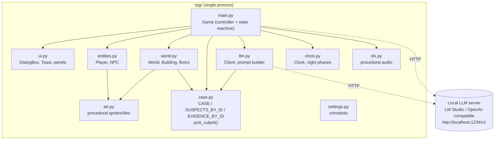
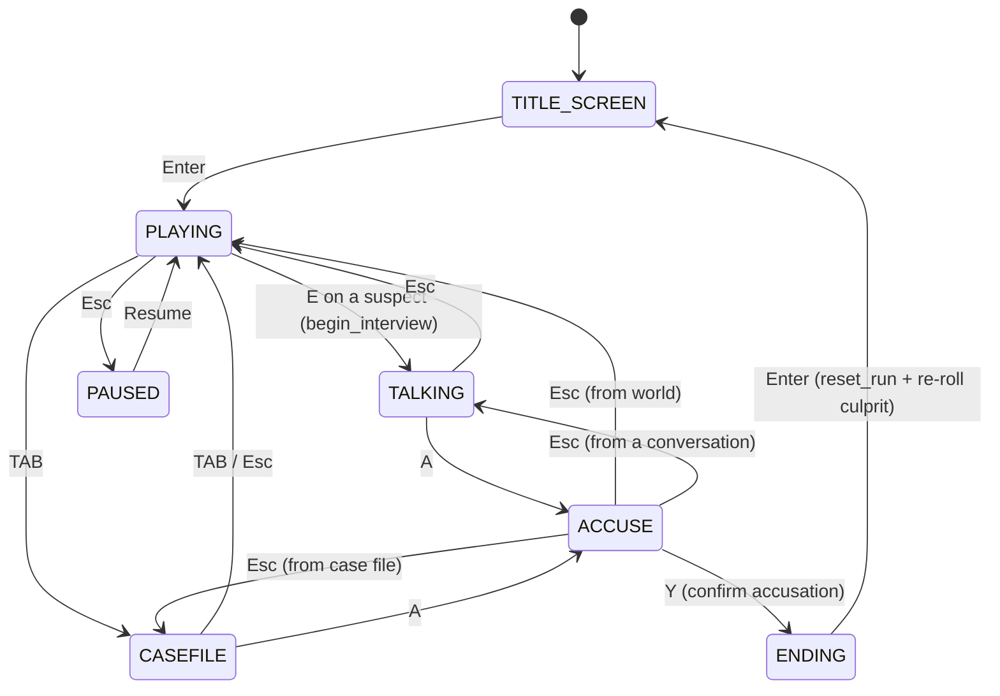
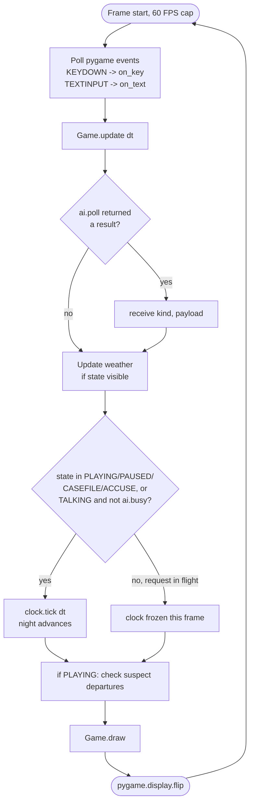
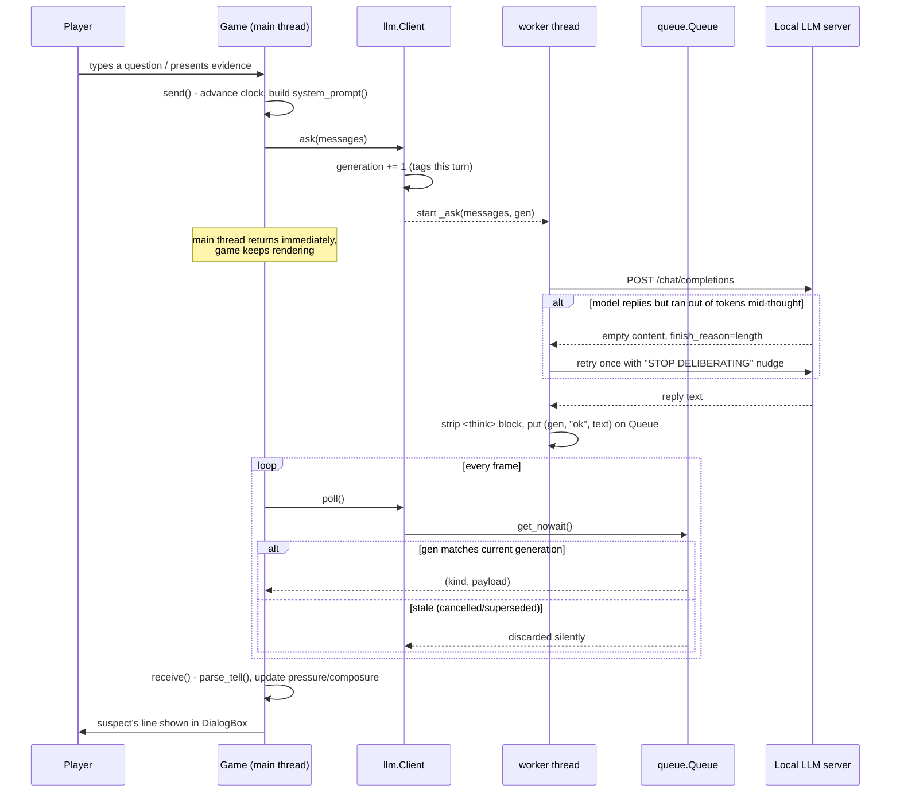
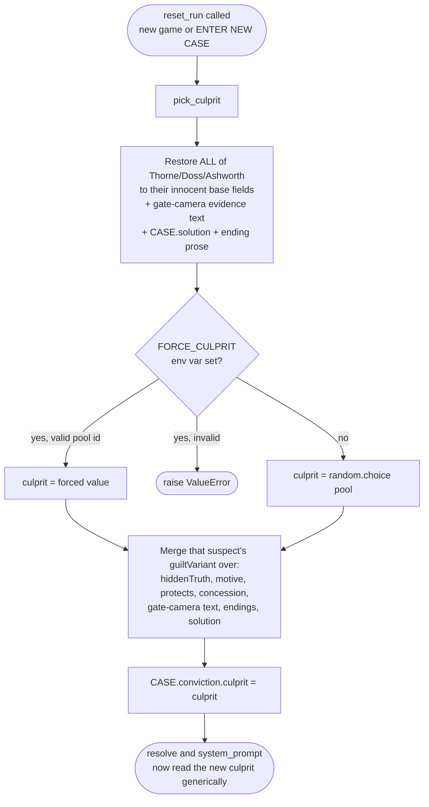
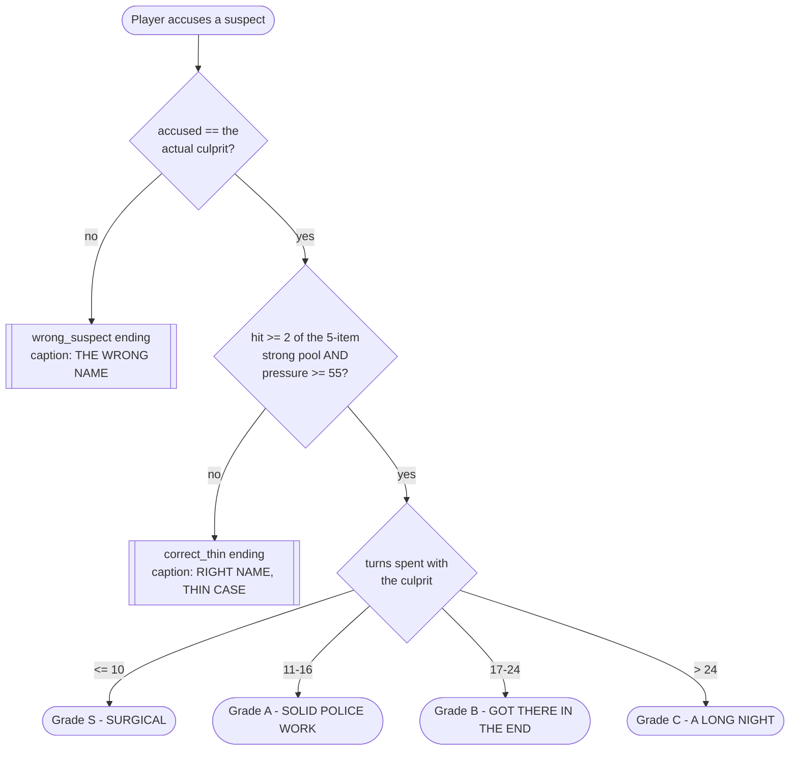
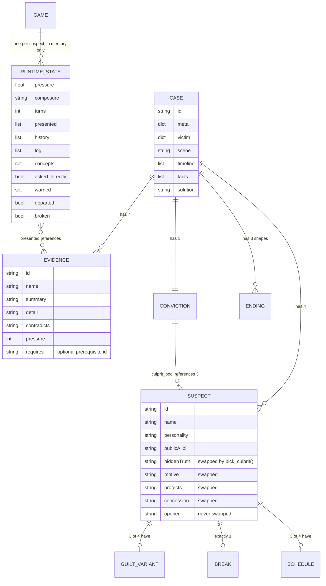

# Diagrams and Data Dictionary — The Vesper Manifest

Every diagram below is drawn from the actual source in `rpg/`, not from the
original design intent — file:line references are given so any diagram can be
checked against the code it describes. Each has a Mermaid version (renders on
GitHub and in most Markdown viewers) and a plain-ASCII twin (for the `.txt`
report and anywhere Mermaid isn't available).

## Symbol legend

Used consistently across every diagram below:

| Symbol | Meaning |
|---|---|
| Rectangle | A process / function / module |
| Diamond | A decision point |
| Rounded rectangle | A start/end state |
| Cylinder | A data store (in this project: always an in-memory dict, never a database) |
| Solid arrow `→` | Synchronous call / direct data flow, same thread |
| Dashed arrow `-->` | Asynchronous / cross-thread communication |

---

## 1. System architecture



```
ASCII:

  +-------------------------------------------------------------+
  |                     rpg/ (single process)                   |
  |                                                               |
  |   main.py (Game: controller + state machine)                 |
  |     |     |      |        |         |         |              |
  |     v     v      v        v         v         v              |
  |    ui.py entities world.py case.py  llm.py   clock.py         |
  |          .py       |         ^        |                       |
  |                     v         |        |                      |
  |                   art.py -----+        |                      |
  |                                        |                      |
  +----------------------------------------|----------------------+
                                            | HTTP (urllib, threaded)
                                            v
                          +----------------------------------+
                          |  Local LLM server (LM Studio /    |
                          |  OpenAI-compatible endpoint)       |
                          |  http://localhost:1234/v1          |
                          +----------------------------------+
```

Reference: imports at `main.py:9-25`; `llm.py:15,17` for the external
dependency.

---

## 2. State machine



```
ASCII:

   [TITLE_SCREEN] --Enter--> [PLAYING] <--Esc-- [PAUSED]
                                 |  ^              ^
                          E on   |  | Esc          | Esc
                        a suspect| TAB/Esc          |
                                 v  |               |
                            [TALKING]           [CASEFILE]
                                 |                   |
                              A |                 A  |
                                 v                   v
                              [ACCUSE] <---Esc-------+
                                 |
                              Y (confirm)
                                 v
                             [ENDING] --Enter--> [TITLE_SCREEN]
                                              (reset_run: re-rolls culprit)
```

`ACCUSE`'s return state is tracked in `self.accuse_return` (`main.py:193,
835-839`) so Esc goes back to whichever screen opened it. Reference:
`main.py:27` for the 7 states, `on_key()` (`main.py:757-833`) for every
transition.

---

## 3. Main loop



```
ASCII:

  +----------------------------------------------------------+
  |  loop (60 FPS):                                           |
  |    read input (keyboard)                                  |
  |    update(dt):                                             |
  |      poll AI worker thread for a finished reply            |
  |      update weather (cosmetic)                             |
  |      IF state in {PLAYING, PAUSED, CASEFILE, ACCUSE}        |
  |         OR (TALKING and no request in flight):              |
  |          tick the night clock forward                       |
  |      ELSE: clock frozen (a reply is in flight)               |
  |      if PLAYING: check suspect departure schedules           |
  |    draw()                                                    |
  |    flip to screen                                            |
  +----------------------------------------------------------+
```

Reference: `main.py:979-1039` (`update`), `main.py:1741-1752` (`_run`). The
clock-tick condition at `main.py:1012` is the game's core pacing rule — it is
what stops a slow model reply from silently spending the player's night for
them (see `docs/diagrams.md` §4 below for why a reply can take so long).

---

## 4. LLM request pipeline



```
ASCII:

  Player types Q          Game (main thread)         Worker thread        LLM server
       |                        |                          |                  |
       |--question------------>|                          |                  |
       |                        |--send(): build prompt--->|                  |
       |                        |--ask(): gen+=1, spawn---->|                  |
       |                        |  (returns immediately,    |--POST----------->|
       |                        |   game keeps rendering)   |                  |
       |                        |                           |<--reply----------|
       |                        |                           | (retry once if   |
       |                        |                           |  empty+length)   |
       |                        |                           |--strip <think>-->|
       |                        |                           |--queue.put(gen,--+
       |                        |                           |   "ok", text)    |
       |                        |<--poll() each frame-------|                  |
       |                        |  (drops stale generation) |                  |
       |                        |--receive(): parse_tell,   |                  |
       |                        |  update pressure/mood     |                  |
       |<--dialogue box updates-|                            |                  |
```

Reference: `main.py:564-583` (`send`), `llm.py:130-135` (`ask`), `llm.py:176-
212` (`_ask`), `llm.py:214-225` (`poll`), `main.py:620-716` (`receive`). The
generation-tag discard (`llm.py:224`) is what makes `cancel()` (`main.py:938`)
safe even though the worker thread itself cannot actually be killed.

---

## 5. Culprit randomization



```
ASCII:

  reset_run() (new game, or "ENTER NEW CASE" from ending screen)
       |
       v
  pick_culprit():
    1. restore Thorne, Doss, AND Ashworth to their innocent text
       (so last run's guilty text can never leak forward)
    2. FORCE_CULPRIT env var set and valid?  -> use it
       FORCE_CULPRIT set but invalid?        -> raise (fail loud, not silent)
       otherwise                             -> random.choice(pool)
    3. merge the picked suspect's guiltVariant over the shared data:
         hiddenTruth, motive, protects, concession,
         gate-camera evidence text, both ending proses, the solution
    4. CASE["conviction"]["culprit"] = <picked id>
       -> resolve() and system_prompt() both read this key generically,
          with zero changes needed elsewhere in the codebase
```

Reference: `case.py:672-704`. Bricker is excluded from the pool
(`case.py:584`) because his own `publicAlibi` states as fact that he has no
vault access.

---

## 6. Resolution decision tree



```
ASCII:

  Player accuses suspect X
       |
       v
  Is X the actual culprit? ----no----> "wrong_suspect" ending
       | yes
       v
  >=2 of {vault-ledger, gate-camera, burner-phone,        ----no----> "correct_thin" ending
  proof-of-life-photo, bricker-account} shown to X
  AND pressure(X) >= 55 ?
       | yes
       v
  turns spent with X:
     <= 10   -> Grade S  "SURGICAL"
     11-16   -> Grade A  "SOLID POLICE WORK"
     17-24   -> Grade B  "GOT THERE IN THE END"
     > 24    -> Grade C  "A LONG NIGHT"
```

Reference: `main.py:718-753` (`resolve`). This function reads
`CASE["conviction"]["culprit"]` generically and needed **no changes** to
support culprit randomization.

---

## 7. Data model



```
ASCII:

  CASE (module-level dict, rpg/case.py)
    |-- meta, victim, scene, timeline, facts, solution
    |-- suspects[4]  --------------------> SUSPECT
    |                                        |-- break (1 of 3 mechanic types)
    |                                        |-- schedule (3 of 4 suspects)
    |                                        |-- guiltVariant (3 of 4 suspects)
    |-- evidence[7]  --------------------> EVIDENCE
    |-- conviction { culprit_pool, culprit (runtime), strong{...} }
    |-- endings { correct_strong, correct_thin, wrong_suspect }

  Game.convo[suspect_id]  (RUNTIME STATE - in memory only, never saved)
    pressure, composure, turns, presented[], history[], log[],
    concepts{}, asked_directly, warned{}, departed, last_typed, broken
```

Reference: `case.py:13-643` (`CASE` literal), `main.py:166-182`
(`Game.convo` construction in `reset_run`).

---

## Data Dictionary

### CASE (top level) — `rpg/case.py:13`

| Field | Type | Required | Description |
|---|---|---|---|
| `id` | str | yes | Case identifier, `"the-vesper-manifest"` |
| `title` | str | yes | Display title |
| `meta` | dict | yes | `title_lines`, `subtitle`, `opening` text, `spawn` tile coords |
| `victim` | dict | yes | `name`, `detail` |
| `scene` | str | yes | The crime-scene description shown in the case file |
| `timeline` | list[tuple(str,str)] | yes | (`when`, `what`) pairs |
| `facts` | list[str] | yes | Facts no suspect may contradict; injected into every system prompt |
| `suspects` | list[dict] | yes | 4 suspect records (see below) |
| `evidence` | list[dict] | yes | 7 evidence records (see below) |
| `conviction` | dict | yes | `culprit_pool`, `culprit` (runtime-only key), `strong` (pool/requires_count/minPressure) |
| `endings` | dict | yes | `correct_strong`, `correct_thin`, `wrong_suspect`, each with `caption`/`prose` |
| `solution` | str | yes | Full reveal text; overwritten per-culprit by `pick_culprit()` |

### Suspect record — one entry of `CASE["suspects"]`

| Field | Type | Required | Swapped by `pick_culprit()`? |
|---|---|---|---|
| `id`, `name`, `sprite`, `role` | str | yes | no |
| `personality`, `publicAlibi`, `opener` | str | yes | no |
| `hiddenTruth`, `motive`, `protects`, `concession` | str | yes | **yes** — base (innocent) value, or the picked culprit's `guiltVariant` value |
| `break` | dict | yes | no — mechanic never changes with guilt |
| `break.type` | str enum | yes | `threshold_any` \| `evidence_plus_question` \| `conversational_trigger` |
| `schedule` | dict | 3 of 4 | `leaves_at` (minute), `warnings` (list of (minute, text)), `vacated` (text) |
| `guiltVariant` | dict | 3 of 4 (not Bricker) | The alternate hiddenTruth/motive/protects/concession/gate_camera_text/endings/reveal_text/solution used only if this suspect is picked guilty |

### Evidence record — one entry of `CASE["evidence"]`

| Field | Type | Required | Description |
|---|---|---|---|
| `id`, `name` | str | yes | Identifier and display name |
| `summary` | str | yes | Short line sent to the model when presented (`main.py:600`) |
| `detail` | str | yes | Long text shown in the case file |
| `contradicts` | str | yes | What this exhibit disproves |
| `found_text` | str | yes | Text shown on pickup |
| `pressure` | int | yes | Weight toward the deterministic pressure floor |
| `requires` | str | optional | Prerequisite evidence id (e.g. `gate-camera` requires `vault-ledger`) |
| `locked_text` | str | only if `requires` set | Shown if examined before the prerequisite is found |
| `sourced` | str | optional | `"dialogue"` for the one evidence item unlocked by conversation, not the world |

### Runtime state — `Game.convo[suspect_id]`, in memory only

| Field | Type | Description |
|---|---|---|
| `pressure` | float 0-100 | Drives composure and the strong-ending threshold |
| `composure` | str enum | `steady` \| `rattled` \| `cracking` |
| `turns` | int | Count of questions/presents; grades S/A/B/C |
| `presented` | list[str] | Evidence ids shown to this suspect |
| `history` | list[dict] | Full chat messages; only the last 16 are re-sent to the model |
| `log` | list[tuple] | Full transcript for the case-file view |
| `concepts` | set[str] | Bricker only — which of 3 ideas have landed |
| `asked_directly` | bool | Doss/Ashworth only — was the exact right question asked |
| `warned` | set | Schedule-warning thresholds already delivered |
| `departed` | bool | Left the map per schedule |
| `last_typed` | str | Last real player-typed text (never a synthesized evidence string) |
| `broken` | bool | Doss/Ashworth only — statement page unlocked |

This entire structure is rebuilt from scratch by `reset_run()` (`main.py:166`)
and is never written to disk — see the project summary's Chapter 3 note on
save/load.
